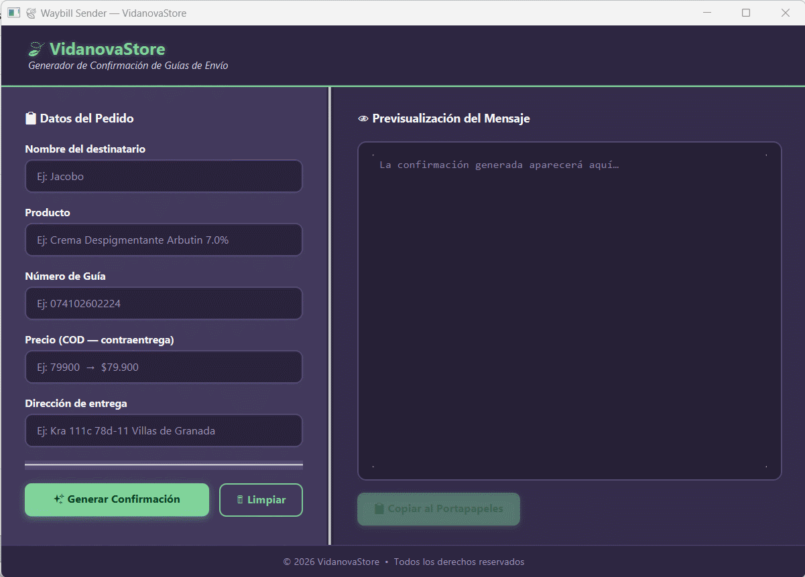
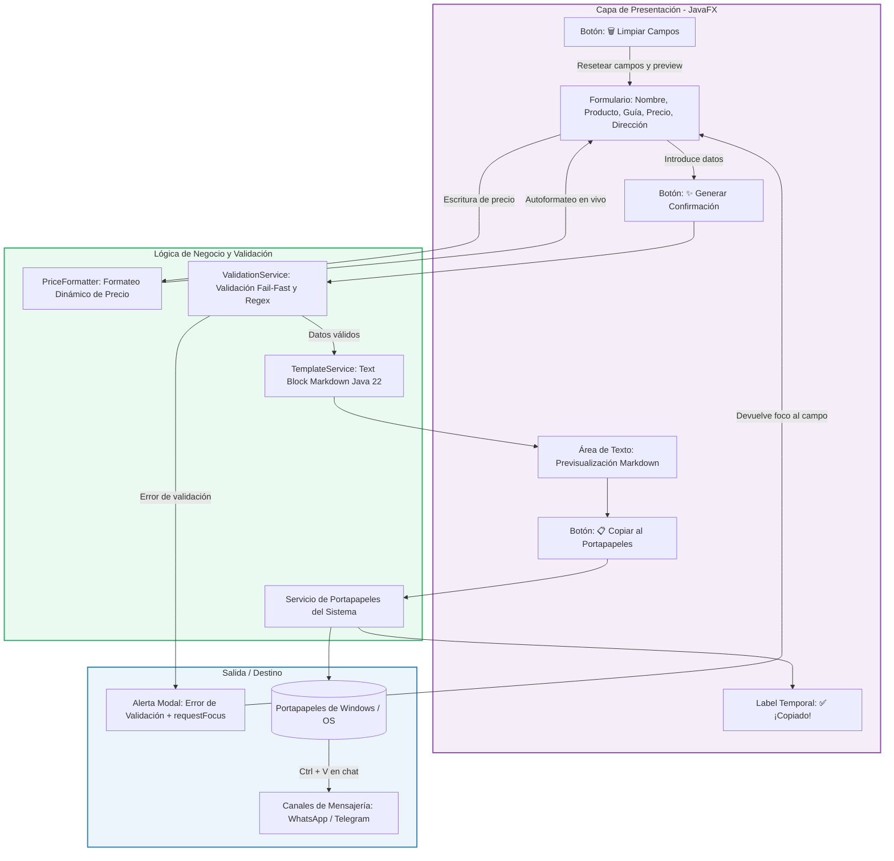

# 📖 GUÍA RÁPIDA DEL PROYECTO: VIDANOVA STORE - WAYBILL SENDER 🍃
Este proyecto es una **Aplicación de Escritorio Moderna** desarrollada en **Java 22** con **JavaFX 22** y empaquetada
con **Maven**, diseñada como una herramienta operativa de alta productividad para la generación instantánea de plantillas
de **confirmación y despacho de guías de envío** en formato **Markdown con Emojis** para la tienda de comercio electrónico **VidanovaStore**.

La solución implementa una interfaz gráfica moderna estilizada mediante **CSS modular**, una arquitectura multicapa desacoplada y ligera
orientada a rendimiento inmediato (cero sobrecarga de frameworks pesados), integración nativa con el **Portapapeles del Sistema**,
estrategia de validación **Fail-Fast** con autoenfoque de errores, formateo dinámico de moneda en tiempo real y empaquetado autónomo en **JAR ejecutable**.

**_Autor: Saul Echeverri Duque_**   
_Edición: 2026_




## Comenzando 🚀
El propósito de esta aplicación es resolver de manera eficiente la captura, validación y estandarización de los mensajes de confirmación
de despachos y guías que se envían a los clientes vía mensajería (WhatsApp, Telegram o canales de soporte), aplicando:
* **Java 22 Modern Features:** Empleo de *Text Blocks* multilínea con interpolación limpia de cadenas (`formatted`), *Java Records* inmutables para transferencia de datos, tipado inferido y código limpio.
* **JavaFX 22 UI & UX:** Diseño centrado en el usuario con formularios estructurados en paneles duales (`BorderPane`, `VBox`, `HBox`), previsualización instantánea en tiempo real y alertas modales contextuales.
* **Estilizado CSS Modular (UI Branding):** Identidad corporativa moderna basada en colores pastel inspirados en el logo de la tienda: fondo morado lavanda (`#38304F` / `#42395C`), botones en verde pastel (`#80D39B`), acentos en verde bosque (`#0B502F`) y tipografía blanca contrastada de alta legibilidad.
* **Formateo Dinámico de Moneda:** Conversión automática en tiempo real de valores numéricos a formato de moneda con separador de miles por puntos (ej. `79900` ➡️ `$79.900`).
* **Validación Proactiva Fail-Fast:** Control estricto de entradas mediante expresiones regulares (Regex) con detección inmediata del primer error y redirección del foco (`requestFocus()`) al campo afectado.
* **Empaquetado y Ejecución Ágil:** Configuración autónoma mediante `Launcher` puente desacoplado para evitar conflictos de carga de módulos en entornos Java modernos.

---

## 1. REQUISITOS DEL SISTEMA ⚙️
Para compilar y ejecutar este proyecto en tu entorno local, necesitas contar con las siguientes herramientas:

### Requisitos Previos 🔧
* **Java Development Kit (JDK):** Versión 22 o superior (Amazon Corretto, Eclipse Temurin u Oracle OpenJDK).
* **Apache Maven:** Versión 3.9+ para la gestión del ciclo de vida y empaquetado del proyecto.
* **Sistema Operativo:** Windows 10/11, macOS o distribuciones Linux compatibles con JavaFX.
* **Git:** Para clonación y control de versiones.

Verifica tu versión de Java y Maven:
```shell
java -version
mvn -version
```

#### Clonar el Repositorio
Para comenzar, clona este repositorio en tu máquina local usando Git:

```shell
git clone https://github.com/saulolo/waybill-sender.git
cd waybill-sender
```

---

## Despliegue y Ejecución 📦
En esta sección se detallan las opciones disponibles para compilar, ejecutar en desarrollo o empaquetar la aplicación para distribución final.

### Despliegue Local 🏠
**Opción A**: Ejecución Directa en Desarrollo (Consola / IDE)  
Puedes ejecutar la aplicación directamente sin compilar el JAR final:

```shell
# Ejecutar mediante el plugin oficial de JavaFX para Maven
mvn javafx:run
```

O mediante ejecución directa de clase principal:
```shell
mvn compile exec:java -Dexec.mainClass="com.vidanova.shipping.Launcher"
```

O bien, desde **IntelliJ IDEA**:  
1. Abre el proyecto en IntelliJ IDEA.
2. Localiza el archivo `src/main/java/com/vidanova/shipping/Launcher.java`.
3. Haz clic derecho sobre el archivo o en el ícono ▶️ verde y selecciona **Run 'Launcher.main()'**.

**Opción B**: Compilación y Generación del Ejecutable Autónomo (JAR)
Para compilar y empaquetar el proyecto listo para distribución:

#### 1. Limpiar y empaquetar el proyecto
```shell
mvn clean package
```

#### 2. Localizar y ejecutar el binario
Al finalizar el proceso con `BUILD SUCCESS`, se generará en la carpeta `/target`:  
- `waybill-sender-1.0.0.jar`

Puedes ejecutarlo desde terminal o mediante doble clic sobre el archivo `.jar`:

```shell
java -jar target/waybill-sender-1.0.0.jar
```

---

## 2. ESTRUCTURA DEL PROYECTO 🏗️
El proyecto sigue una arquitectura multicapa desacoplada, modular y mantenible bajo las mejores prácticas de proyectos Maven y JavaFX estándar:

```text
waybill-sender/
├── src/
│   └── main/
│       ├── java/
│       │   └── com/vidanova/shipping/
│       │       ├── Launcher.java               # Clase puente de arranque (sin herencia de Application)
│       │       ├── MainApp.java                # Inicializador de la aplicación JavaFX y Scene
│       │       ├── controller/
│       │       │   └── MainController.java     # Controlador FXML, listeners y eventos de usuario
│       │       ├── model/
│       │       │   └── ShippingData.java       # Record inmutable de transporte de datos (DTO)
│       │       ├── service/
│       │       │   ├── TemplateService.java    # Generador de la plantilla Markdown con Text Blocks
│       │       │   └── ValidationService.java  # Lógica de validación Fail-Fast y Regex
│       │       └── util/
│       │           └── PriceFormatter.java     # Utilidad de formato de moneda con separador de miles
│       └── resources/
│           └── com/vidanova/shipping/
│               ├── main-view.fxml              # Definición declarativa de la interfaz (Dual Panel)
│               └── styles.css                  # Hoja de estilos con branding minimalista
├── target/
├── .gitignore
├── pom.xml
└── README.md
```

### Descripción de Componentes Clave:
- `Launcher.java`: Clase puente con método `main` estático. Evita el conflicto clásico de carga de módulos (*unnamed module*) al ejecutar aplicaciones JavaFX en Java moderno desde classpath.
- `MainApp.java`: Clase principal que extiende de `Application`. Inicializa el `Stage`, carga el FXML, vincula la hoja de estilos y define las dimensiones mínimas de la ventana.
- `MainController.java`: Controlador que coordina la interfaz, implementa el formateo reactivo del precio al escribir, dispara la validación y transfiere el resultado al portapapeles con confirmación visual temporal.
- `ShippingData.java`: *Java Record* compacto e inmutable que encapsula los 5 datos del formulario con cero código repetitivo.
- `ValidationService.java`: Servicio de validación centralizado que implementa el patrón **Fail-Fast** con expresiones regulares y lanza excepciones tipadas (`ValidationException`) asociando el identificador del campo con error para hacer autofoco.
- `TemplateService.java`: Ensamblador de la plantilla Markdown utilizando *Text Blocks* nativos de Java, garantizando que los emojis y saltos de línea se generen con absoluta fidelidad.
- `PriceFormatter.java`: Componente utilitario que asegura la correcta presentación y desformateo numérico en pesos colombianos.
- `main-view.fxml`: Vista construida en XML estructurada en dos áreas de trabajo: panel de captura a la izquierda y visor de previsualización monoespaciado a la derecha.
- `styles.css`: Sistema de diseño moderno basado en CSS JavaFX con paleta corporativa morado lavanda y verde pastel, estados interactivos y tipografía blanca.
- `pom.xml`: Orquestador de Maven con dependencias de JavaFX 22/23 (`javafx-controls`, `javafx-fxml`), compilador Java 22 y plugins de despliegue.

---

## 3. ESPECIFICACIONES TÉCNICAS Y REQUERIMIENTOS 📋

El proyecto fue desarrollado cumpliendo estrictamente los siguientes requerimientos técnicos:

* **Plataforma base:** **Java 22** + **JavaFX 22.0.2 / 23.0.1**. ✅
* **Gestor de dependencias y compilación:** **Apache Maven 3.9+**. ✅
* **Arquitectura de UI:** Layout interactivo con `BorderPane`, `VBox`, `HBox`, `Separator` y paneles independientes. ✅
* **Gestión de portapapeles:** Integración nativa con `Clipboard` y `ClipboardContent` para copia instantánea con un solo clic. ✅
* **Plantilla Markdown con Emojis:** Interpolación estructurada mediante *Text Blocks* multilínea preservando emojis nativos. ✅
* **Validación Fail-Fast y Autoenfoque:** Verificación estricta (campos vacíos, formato alfabético, número de guía y precio válido) con modal de error (`Alert.AlertType.ERROR`) y retorno automático de foco (`requestFocus()`). ✅
* **Formateo Reactivo de Precio:** Entrada numérica formateada automáticamente con signo pesos y separadores de miles por puntos (`$79.900`). ✅
* **Diseño visual (UI Branding):** Paleta inspirada en el logo de VidaNova con fondo morado pastel (`#38304F` / `#42395C`), botones en verde pastel (`#80D39B`), texto de campos en blanco puro y tipografía moderna `Segoe UI`. ✅
* **Arquitectura Limpia y Desacoplada:** Separación total de responsabilidades bajo el patrón MVC (Modelo, Vista, Controlador, Servicios y Utilidades). ✅

---

## 4. FLUJO DE FUNCIONAMIENTO DE LA APLICACIÓN 📊



### Formato de la Plantilla Markdown Generada
```markdown
*CONFIRMACIÓN GUIA*
¡Hola, Jacobo! 👋 Te saludamos nuevamente de 🍃VidanovaStore.

Te confirmamos que tu pedido de la Crema Despigmentante Arbutin 7.0% + TXA 4.0% ya fue empacado y entregado a la transportadora. 📦✨

🚚 *Número de Guía*: 074102602224
🔗 *Rastreo*: Puedes consultar el estado de tu paquete directamente en la página web de la transportadora con ese número de guía.

El tiempo estimado de entrega es de *2 a 4 días hábiles*.
💵 Recuerda tener listos los *$79.900* en efectivo para cuando el repartidor llegue a tu dirección (Kra 111c 78d-11 Villas de Granada).

¡Cualquier duda que tengas durante el camino, nos puedes escribir por aquí! Que tengas un excelente día. 😊
```

### Flujo del Proceso de la Aplicación
1. **Inicio e Inicialización (Bootstrap):** El usuario arranca la aplicación ejecutando la clase puente `Launcher`, la cual inicializa el entorno JavaFX sin conflictos de módulos, carga `main-view.fxml`, aplica los estilos de `styles.css` y despliega la ventana principal con título e identidad visual.
2. **Entrada y Formateo Reactivo de Datos:** El operador introduce la información en los 5 campos del formulario. Al tipear en el campo **Precio**, un listener dedicado extrae los dígitos y formatea el valor en tiempo real con separador de miles por puntos (ej: `79900` ➡️ `$79.900`), posicionando el cursor al final de forma transparente.
3. **Disparo de la Generación:** El usuario presiona el botón **"✨ Generar Confirmación"**, activando el método `handleGenerar()` del controlador.
4. **Validación Proactiva (Fail-Fast):**
   - El sistema valida inmediatamente que ninguno de los 5 campos esté vacío (`isBlank()`).
   - Verifica mediante Regex que **Nombre** solo contenga letras (con tildes, diéresis y espacios).
   - Valida mediante Regex que **Número de Guía** contenga exclusivamente dígitos numéricos (`^[0-9]+$`).
   - Valida que el **Precio** corresponda a un número positivo válido.
   - En caso de presentarse algún error, el flujo se detiene de inmediato, se muestra una ventana modal de error (`Alert.AlertType.ERROR`) indicando el campo erróneo y su motivo, y al cerrar el diálogo el cursor se enfoca automáticamente en dicho campo (`target.requestFocus()`).
5. **Construcción de la Plantilla Markdown:** Habiendo superado la validación, `TemplateService` inyecta los datos limpios en un *Text Block* multilínea con formato preestablecido, manteniendo emojis, negritas y espaciados de WhatsApp intactos.
6. **Previsualización en Pantalla:** El texto formateado se renderiza en el `TextArea` de previsualización monoespaciado para que el usuario verifique la información. En este punto se habilita el botón de copia.
7. **Copia al Portapapeles con Confirmación Visual:** Al hacer clic en **"📋 Copiar al Portapapeles"**, el contenido se transfiere al portapapeles nativo del sistema operativo (`Clipboard.getSystemClipboard()`) y se activa una etiqueta visual transitoria (**"✅ ¡Copiado al portapapeles!"**) que desaparece suavemente tras 2.5 segundos.
8. **Envío al Cliente:** El operador abre WhatsApp Web u otro canal de atención y presiona `Ctrl + V` para pegar el mensaje perfectamente estructurado sin riesgos de digitación.

### Resumen del Flujo del Proceso:
`Operador (Formulario UI)` ➡️ `Autoformato de Precio` ➡️ `Validación Fail-Fast (Regex + Campos)` ➡️ `TemplateService (Text Block)` ➡️ `TextArea (Previsualización)` ➡️ `Clipboard OS` ➡️ `Pegar en WhatsApp (Ctrl + V)`

---

## 5. CAMPOS DEL FORMULARIO 📝

| Campo | Componente UI | Ejemplo de Entrada | Regla de Validación | Descripción |
| :--- | :--- | :--- | :--- | :--- |
| **Nombre** | `TextField` | `Jacobo` | Solo letras y espacios (admite tildes y ñ: `^[a-zA-ZÀ-ÿ\s]+$`) | Nombre completo del destinatario del paquete |
| **Producto** | `TextField` | `Crema Despigmentante Arbutin 7.0% + TXA 4.0%` | Texto libre no vacío | Descripción del producto empacado y despachado |
| **Número de Guía** | `TextField` | `074102602224` | Solo dígitos numéricos (`^[0-9]+$`) | Código numérico de rastreo provisto por la transportadora |
| **Precio** | `TextField` | `79900` ➡️ `$79.900` | Valor numérico positivo con autoformateo | Valor a cancelar en modalidad contraentrega (COD) |
| **Dirección** | `TextField` | `Kra 111c 78d-11 Villas de Granada` | Alfanumérico no vacío | Dirección física de residencia o entrega del cliente |

---

## Autor ✒️
¡Hola! Soy **Saul Echeverri Duque** 👨‍💻, el creador y desarrollador de este proyecto. Permíteme compartir un poco sobre mi
formación y experiencia:

### Formación Académica 📚
- 📖 Titulado en Tecnología en Análisis y Desarrollo de Software por el SENA.
- 🎓 Graduado en Ingeniería de Alimentos por la Universidad de Antioquia, Colombia.
- 👨‍💻 Más de 4 años de experiencia en desarrollo de microservicios con Java, Spring Boot y Angular.

### Trayectoria Profesional 💼
Desarrollador de Software con sólida experiencia en el ecosistema Java y desarrollo de soluciones enfocadas en productividad, 
escalabilidad y buenas prácticas de ingeniería de software.

A lo largo de mi carrera, he aportado valor técnico en diversas empresas del sector tecnológico y financiero:

* 🏢 **[IAS Software](https://www.ias.com.co/) | Desarrollador de Software Full Stack**
* 🏢 **[Cidenet](https://cidenet.net/) | Analista de Desarrollo** 
* 🏢 **Convertic | Analista de Desarrollo** 

### Pasión por la Programación 🚀
- 💻 Mi viaje en el mundo de la programación comenzó en el 2021, y desde entonces, he estado inmerso en el emocionante
  universo del desarrollo de software.
- 📚 Uno de mis mayores intereses y áreas de enfoque es **Java**, y este proyecto es el resultado de mi deseo de compartir
  conocimientos y experiencias relacionadas con este lenguaje.

---

## Propósito y Agradecimientos 🎁
Quiero expresar mi sincero agradecimiento a todas las personas y clientes que confían día a día en [VidanovaStore 🍃](https://vidanovastore.com/).

Este proyecto nace de la convicción de que la tecnología y la ingeniería de software deben ser aliadas directas del 
emprendimiento, permitiendo transformar procesos operativos manuales en flujos de trabajo ágiles, libres de errores y 
altamente profesionales.

El desarrollo de esta herramienta representa no solo la optimización logística de mi tienda, sino también un espacio 
continuo de aprendizaje y aplicación práctica del ecosistema **Java moderno**, demostrando que soluciones simples y bien 
diseñadas generan un impacto real e inmediato en el día a día de un negocio.

---

## Créditos y Contacto 📜
Este proyecto fue desarrollado por [Saul Echeverri](https://github.com/saulolo)
con la finalidad de optimizar la comunicación logística y la experiencia de entrega de [VidanovaStore 🍃](https://vidanovastore.com/).

Agradezco sinceramente el tiempo dedicado a la revisión de este proyecto. Valoro profundamente cualquier feedback técnico 
sobre las decisiones de arquitectura, diseño reactivo y buenas prácticas aplicadas. Quedo a total disposición para 
profundizar en cualquier detalle de la implementación:
- GitHub: [https://github.com/saulolo](https://github.com/saulolo) 🌐
- Correo Electrónico: [saulolo@gmail.com](mailto:saulolo@gmail.com) 📧
- LinkedIn: [https://www.linkedin.com/in/saul-echeverri-duque/](https://www.linkedin.com/in/saul-echeverri-duque/) 💼

---

### METADATOS DEL DOCUMENTO 📄

| Campo                    | Detalles                                                                                                        |
|:-------------------------|:----------------------------------------------------------------------------------------------------------------|
| **Título**               | GUÍA RÁPIDA DEL PROYECTO: VIDANOVA STORE - WAYBILL SENDER                                                      |
| **Autor(es)**            | Saul Echeverri Duque                                                                                            |
| **Versión**              | 1.0.0                                                                                                           |
| **Fecha de Creación**    | 24 de Septiembre de 2026                                                                                        |
| **Última Actualización** | 24 de Septiembre de 2026                                                                                        |
| **Notas Adicionales**    | Aplicación de escritorio desarrollada en Java 22 y JavaFX para la estandarización y despacho de guías de envío.  |

---
